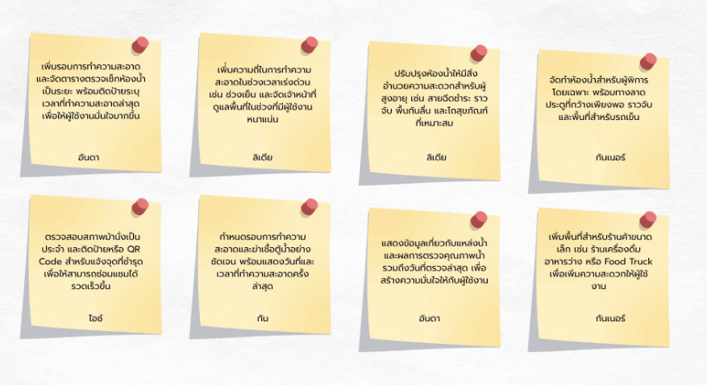
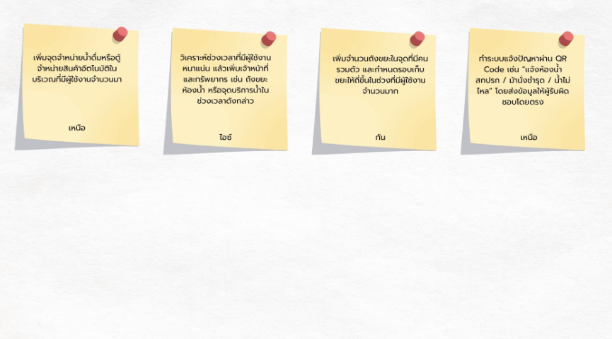
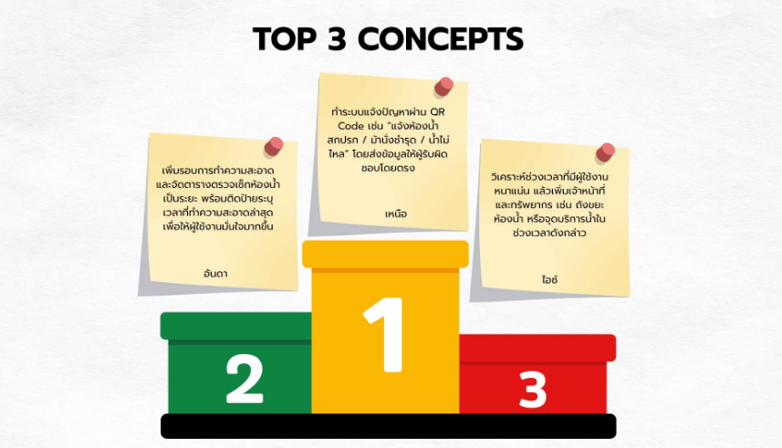

# How Might We (HMW)
เราจะยกระดับความสะอาด ความสะดวก และสิ่งอำนวยความสะดวกภายในพื้นที่ รวมถึงออกแบบระบบการดูแลพื้นที่ให้สามารถรองรับผู้ใช้งานจำนวนมากได้อย่างมีประสิทธิภาพ เพื่อสร้างประสบการณ์ที่ดีและความมั่นใจให้แก่ผู้ใช้งานได้อย่างไร?

### 💡 Idea - ไอเดียแนวทาง 
### 📌 Top Concepts

# Top Concepts
อันดับ 1 ระบบแจ้งปัญหาผ่าน QR Code เหตุผลที่เหมาะที่สุด แก้ปัญหาได้หลาย Pain Point ในระบบเดียว ทำ Prototype ได้ง่าย เช่น QR Code → แบบฟอร์มแจ้งปัญหา → Dashboard ของเจ้าหน้าที่ สามารถเพิ่มฟังก์ชันได้หลากหลาย เช่น ระบุจุดเกิดปัญหา, แนบรูป, เลือกประเภทปัญหา และติดตามสถานะ

อันดับ 2 ระบบจัดตารางและแสดงเวลาทำความสะอาดห้องน้ำ 

อันดับ 3 วิเคราะห์ช่วงเวลาที่มีผู้ใช้งานหนาแน่น วิเคราะห์ช่วงเวลาที่คนเยอะ แล้วเพิ่มเจ้าหน้าที่และทรัพยากรในช่วงนั้น สามารถนำแนวคิดมายุบรวมกันมาทำเป็นprototypeไปในทิศทางไหนได้บ้าง จุดประสงค์คืออะไร และควรมีfeaturesหลักอะไรบ้างเพื่อให้ได้ประโยชน์กับผู้ที่ใช้บริการที่สวนธนบุรีรมย์

# Feature หลัก
- QR Code แจ้งปัญหา สามารถสแกน QR Code ตามจุดต่าง ๆ ภายในสวนเพื่อแจ้งปัญหา เช่น ห้องน้ำสกปรก น้ำไม่ไหล ม้านั่งชำรุด หรือถังขยะเต็ม

- ระบุตำแหน่งและประเภทของปัญหา ผู้ใช้งานสามารถเลือกจุดที่พบปัญหา ประเภทปัญหา และแนบรูปภาพหรือรายละเอียดเพิ่มเติมได้

- ติดตามสถานะการแก้ไข แสดงสถานะตั้งแต่แจ้งปัญหา เจ้าหน้าที่รับเรื่อง กำลังดำเนินการ จนถึงแก้ไขเรียบร้อยแล้ว

- ตารางการทำความสะอาดและตรวจสอบ แสดงเวลาที่ทำความสะอาดหรือดูแลพื้นที่ล่าสุด เพื่อเพิ่มความมั่นใจให้กับผู้ใช้บริการ

- Dashboard สำหรับเจ้าหน้าที่ รวบรวมข้อมูลปัญหาและแสดงจุดหรือช่วงเวลาที่พบปัญหาบ่อย เพื่อช่วยวางแผนการทำงาน

- วิเคราะห์ช่วงเวลาการใช้งาน นำข้อมูลมาวิเคราะห์ช่วงเวลาที่มีผู้ใช้บริการหนาแน่น เพื่อเพิ่มรอบทำความสะอาด เจ้าหน้าที่ หรือทรัพยากรในช่วงเวลาดังกล่าว